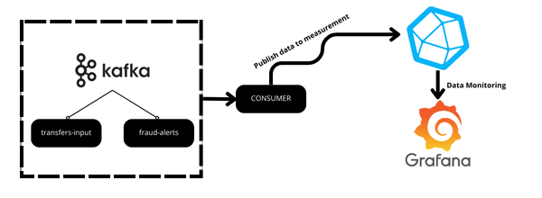
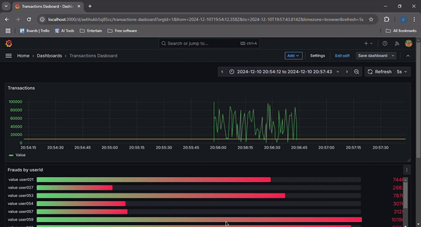

# Application Setup and Overview

## Table of Contents
1. [Overview](#overview)
2. [Architecture](#architecture)
3. [Prerequisites](#prerequisites)
4. [Setup Instructions](#setup-instructions)
   - [Step 1: Clone the Repository](#step-1-clone-the-repository)
   - [Step 2: Configure Token](#step-2-configure-token)
   - [Step 3: Run Docker Services](#step-3-run-docker-services)
   - [Step 4: Run Java Application](#step-4-run-java-application)
   - [Step 5: Configure Grafana](#step-5-configure-grafana)
5. [Preview](#preview)

---

## Overview
This application integrates a Java-based system with InfluxDB, Kafka, and Grafana to process and visualize data. Kafka serves as the messaging backbone, enabling data exchange between different components, while InfluxDB stores time-series data for visualization in Grafana.

---

## Architecture


---

## Prerequisites

1. **Java JDK** (v21 preferably)
2. **Docker** (to run Kafka, InfluxDB, and Grafana images)
3. **Git**

---

## Setup Instructions

### Step 1: Clone the Repository
```bash
git clone https://github.com/ilias-stack/Transactions-Live-Viewer.git
cd Transactions-Live-Viewer
```

### Step 2: Configure Token

change the token value inside the `src/main/resources/token.txt` directory and paste your InfluxDB token into it:

```bash
echo "your-influxdb-token" > src/main/resources/token.txt
```

Additionally, ensure the same token is used in the Grafana data source setup to access InfluxDB.

### Step 3: Run Docker Services

Start the required services (Kafka, InfluxDB, and Grafana) using Docker Compose:

```bash
docker-compose up -d
```

Ensure the containers are running:
```bash
docker ps
```

### Step 4: Run Java Application

Compile and run the Java application:

```bash
javac -d bin src/**/*.java
java -cp bin Main
```

### Step 5: Configure Grafana

1. Open Grafana in your browser at `http://localhost:3000`.
2. Login with the default credentials:
   - **Username:** `admin`
   - **Password:** `admin123`
3. Add a new data source:
   - Select **InfluxDB**.
   - Set the **URL** to `http://influxdb:8086`.
   - Use the token from `src/main/resources/token.txt` for authentication.

---

## Preview


